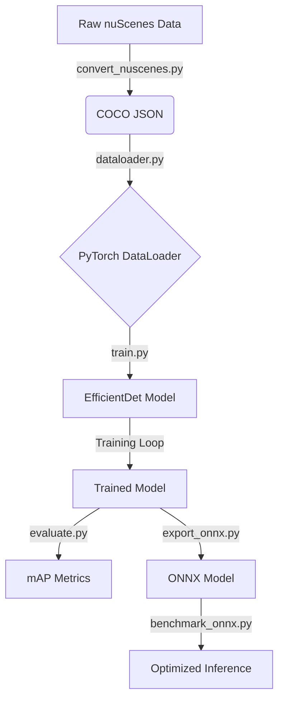

<<<<<<< HEAD
# 🚗 Vehicle Detection with nuScenes & EfficientDet 🚀


This project provides a complete, end-to-end pipeline for training and deploying an **EfficientDet** model for vehicle detection on the **nuScenes-mini** dataset. It covers everything from data conversion and augmentation to model training, evaluation, and ONNX export for high-performance inference.

## 📋 Table of Contents

- [✨ Features](#-features)
- [🏗️ Architecture](#️-architecture)
- [📁 Project Structure](#-project-structure)
- [⚙️ Setup & Installation](#️-setup--installation)
- [🚀 Usage](#-usage)
- [🔧 Configuration](#-configuration)
- [📈 Results](#-results)
- [🤝 Contributing](#-contributing)
- [📜 License](#-license)

## ✨ Features

- 📦 **End-to-End Pipeline:** From raw dataset to a deployable ONNX model.
- 🔄 **Data Conversion:** Seamlessly converts nuScenes format to the standard COCO format.
- 🏋️ **Robust Training:** A configuration-driven training script with rich logging (TensorBoard) and checkpointing.
- 📊 **Comprehensive Evaluation:** Calculates standard COCO mAP metrics to benchmark model performance.
- ⚡ **High-Performance Inference:** Supports ONNX export for fast, platform-agnostic inference.
- 👁️ **Visualization Tools:** Includes scripts to visualize dataset samples and model predictions for qualitative analysis.
- 🧹 **Clean & Modular Code:** Well-organized and commented source code for easy understanding and extension.

## 🏗️ Architecture

The project follows a modular architecture that separates data processing, training, and inference into distinct stages.



1.  **Data Conversion**: The raw nuScenes dataset is first converted into the widely-used COCO annotation format.
2.  **Data Loading**: A custom PyTorch `Dataset` and `DataLoader` in `src/dataloader.py` efficiently loads images and prepares targets for the model.
3.  **Training**: The `src/train.py` script orchestrates the training process, using the `effdet` library's `DetBenchTrain` wrapper for loss calculation and optimization.
4.  **Evaluation**: After training, `src/evaluate.py` uses the validation set to compute COCO mean Average Precision (mAP) to measure the model's accuracy.
5.  **Export & Inference**: The final trained PyTorch model is exported to the ONNX format for fast, cross-platform inference.

## 📁 Project Structure

The repository is organized to maintain a clean separation of data, source code, and model artifacts.

```
.
├── 📁 .github/              # GitHub-specific files
├── 📁 data/                 # (Git-ignored) Dataset files
│   ├── 📁 raw/              # Raw nuScenes data
│   ├── 📁 processed/        # COCO-formatted JSON
│   └── 📁 splits/            # Train/Val/Test splits
├── 📁 models/               # (Git-ignored) Trained model artifacts
│   ├── 📁 efficientdet_d0/   # Checkpoints & logs
│   └── 📁 onnx/              # Exported ONNX models
├── 📁 notebooks/            # Jupyter notebooks for exploration
├── 📁 src/                  # All source code
│   ├── convert_nuscenes.py  # Data conversion script
│   ├── dataloader.py        # PyTorch data loader
│   ├── train.py             # Model training script
│   ├── evaluate.py          # Model evaluation script
│   ├── inference.py         # Inference with PyTorch model
│   ├── export_onnx.py       # ONNX model export script
│   └── utils.py             # Utility functions
├── 📄 .gitignore             # Specifies files for Git to ignore
├── 📄 config.yaml            # Central configuration file
├── 📄 README.md              # This file
└── 📄 requirements.txt       # Python dependencies
```

## ⚙️ Setup & Installation

1.  **Clone the repository:**
    ```bash
    git clone https://github.com/darshan-rj/projAIBEN_vehicle_detection.git
    cd projAIBEN_vehicle_detection
    ```

2.  **Create and activate a virtual environment:**
    ```bash
    python -m venv .venv
    source .venv/bin/activate  # On Windows, use: .venv\Scripts\activate
    ```

3.  **Install the required dependencies:**
    ```bash
    pip install -r requirements.txt
    ```

4.  **Download the Data:**
    Download the [nuScenes-mini dataset](https://www.nuscenes.org/download) and extract it into the `data/raw/` directory. The final structure should be `data/raw/nuScenes-mini/`.

## 🚀 Usage

All scripts are driven by the `config.yaml` file. Make sure to review it before running the scripts.

1.  **Convert the Dataset:**
    First, convert the raw nuScenes data to COCO format and create the train/val/test splits.
    ```bash
    python src/convert_nuscenes.py
    ```

2.  **Train the Model:**
    Start the training process. TensorBoard logs and model checkpoints will be saved in the directory specified in `config.yaml`.
    ```bash
    python src/train.py
    ```
    To monitor training, run TensorBoard:
    ```bash
    tensorboard --logdir models/
    ```

3.  **Evaluate the Model:**
    Run evaluation on the validation set to get performance metrics.
    ```bash
    python src/evaluate.py
    ```

4.  **Export to ONNX:**
    Convert the best-performing PyTorch checkpoint to an ONNX model for deployment.
    ```bash
    python src/export_onnx.py
    ```

5.  **Run Inference:**
    Perform inference on a sample image.
    ```bash
    python src/inference.py --image-path <path_to_your_image>
    ```

## 🔧 Configuration

The `config.yaml` file is the central hub for managing all paths, model parameters, and hyperparameters.

-   **`dataset`**: Paths to raw, processed, and split data files.
-   **`model`**: Defines the model architecture, number of classes, and checkpoint directories.
-   **`training`**: Hyperparameters for the training process, such as batch size, epochs, and learning rate.
-   **`inference`**: Thresholds for confidence and IoU for post-processing predictions.

## 📈 Results

This section can be updated with your model's final performance metrics and sample prediction images.

| Metric | Score |
| :--- | :---: |
| mAP |   -   |
| mAP_50 |   -   |
| mAP_75 |   -   |


## 🤝 Contributing

Contributions are welcome! Please feel free to submit a pull request or open an issue for any bugs, feature requests, or improvements.

1.  Fork the repository.
2.  Create a new feature branch (`git checkout -b feature/YourFeature`).
3.  Commit your changes (`git commit -m 'Add some feature'`).
4.  Push to the branch (`git push origin feature/YourFeature`).
5.  Open a pull request.

## 📜 License

This project is licensed under the MIT License. See the [LICENSE](LICENSE) file for details.
=======
# projAIBEN_nuScenes_dataset
>>>>>>> e65b1bbd98da54b3c656d8392b562c2f0676cd14
